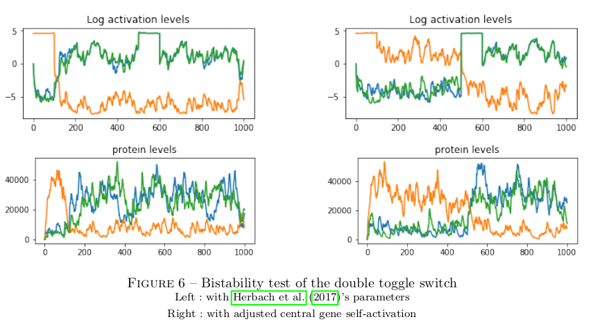
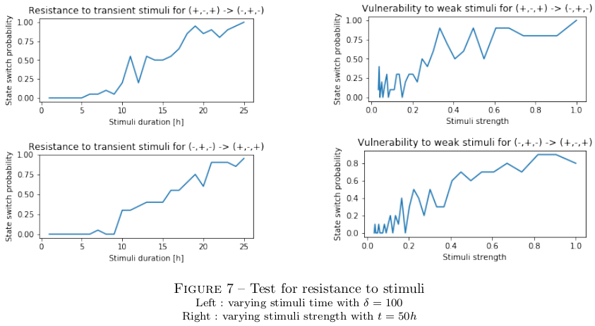
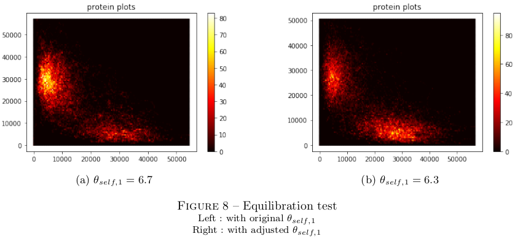

## Analysing the memory properties of the GRN double toggle switch

### Bistability

The very first condition to the implementation of memory is the ability to retain different states through time. I simulate on the left panel below the dynamics of the double toggle switch for symmetric self-activation strength, while forcing the (+,-,+) state from 0h to 100h then the (-,+,-) state from 500 to 600h in simulation time.

As is visible, the system is able to retain the (+,-,+) state without external stimuli, but not the (-,+,-) state. This is because, with parameter at ecological levels (as specified in [Herbach et al, 2017](../conclusion#Herbach et al, 2017)), endogenous variations of the central gene activation are strong enough to inhibit lateral genes. In other words, there is no scale separation in ecological settings, and the functional dynamics of the system cannot be decoupled from expression noise. Rather than tweaking expression parameters at the expense of biological meaning, I could implement bistability by strengthening central gene self-activation, as shown in the right panel above.

### Noise susceptibility

It is necessary for implementing memory that the system be able to change state if and only if it is exposed to relevant stimuli. I tested this condition by testing the system's ability to withstand weak stimuli but constant stimuli, and transcient but strong stimuli.

The results suggest that a state transition may be triggered by a transcient stimuli if and only if it is strong enough, and by a weak stimuli if and only in it is long enough. It follows that, even in the absence of scale separation, the double toggle switch is able to discriminate and retain relevant information.

### Equilibration

While not central to the function of memory, it is relevant to ask whether the system has the same ability to retain different informations through time. I therefore plotted in the left panel below the heatmap of protein population for central and lateral genes while exposing the system to periodic forced transition.

It is manifest that the system spends more time in the (-,+,-) state, while it is exposed to a symmetrical stimuli. This could easily be adjusted by lowering central gene self-activation, as presented in the right panel above.

### Dimensionality

It is also relevant to ask whether the system follows other dynamics in addition to the two-state memory it was expected to implement. I therefore plotted the heatmap of the activation level for central and lateral genes for the same periodic forced transition used to study equilibration.

While the activation pattern is not symetric, it is clear it follows an oblique line in log space. Its activity is therefore one-dimensional, and there are no dynamics relevant to the system beside those of its two-state memory.
