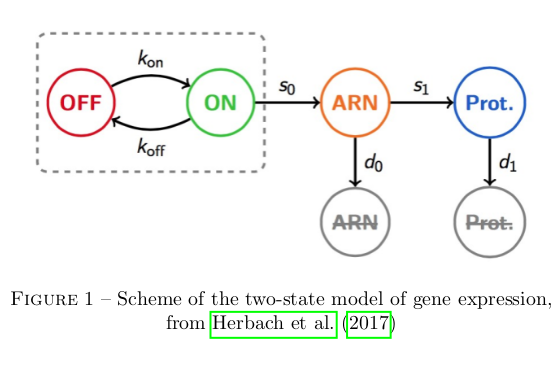
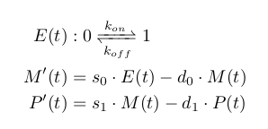
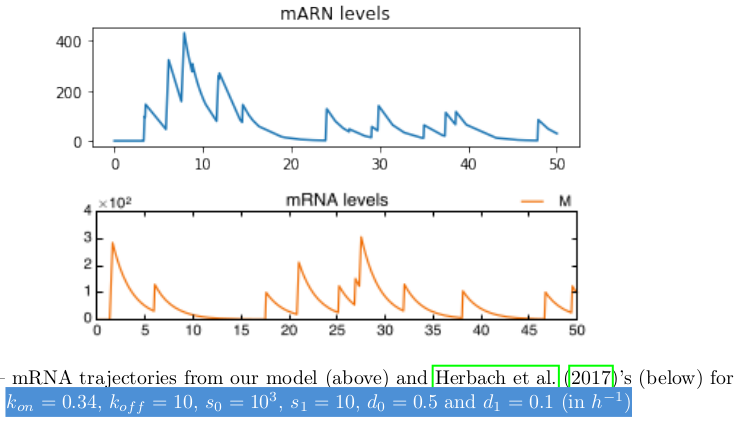
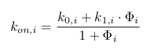
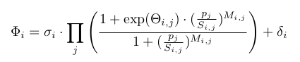
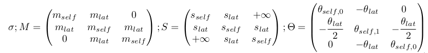
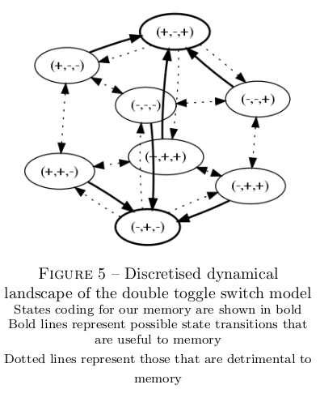

## Implementing the GRN double toggle switch model

### Modelling gene expression

The basic dynamics of gene expression are adapted from [Herbach et al, 2017](../conclusion#Herbach et al, 2017). This paper defines a two states model of gene activation, with three chemical stages involved in expression (genetic activation, mARN density, protein density), as is represented below. I mainly diverge in my explicit separation of self-activation and extrinsic stimulation in gene activation, which is necessary in my attempt to study *in silico* interaction dynamics but not in their analytical inference of activation dynamics from *in vivo* data.

All of these reaction are stochastic events with constant rates and can easily be modelled at a high level of fidelity with the classical Gillespie algorithm [(Gillespie, 1976)](../conclusion#gillespie-1976). Because mARN and protein population are high, it is possible to approximate their variation to be deterministic without loss of information. This turns the dynamic model of a single gene's expression in the Piecewise-Determistic Markov Process defined below (where E, M, and P respectively traduce gene activation state, mARN population, and protein population).

As is manifest below, our approximation does not differ significantly from the dynamics of the pure stochastic model.

### Modelling gene interaction

As genetic modulation was shown to relate more closely to peak frequency than to peak intensity [(Viñuelas et al, 2013)](../conclusion#vinuelas-et-al-2013), I choose to implement gene interaction as a modulation of the gene activation paramater. I use as is classical a Hill function as defined below.

Diverging from [Herbach et al, 2017](../conclusion#Herbach et al, 2017), I model the activation parameter as a multicative function of all protein populations. I include an additive perturbation term, which will mainly serve to force transition *in silico* rather than to model any existing relation. In the following equation, each protein can be shown to have no effect on basal activation when its population is well below an interaction threshold term (S), and to multiply it by the exponential of an interaction strength term (theta) when it is well above.

### Building the double toggle switch

My goal is to study the ability of a gene regulatory pattern with a double toggle switch structure, as is represented below, to implement memory.

To retain tractability with the classical toggle switch pattern, I impose symmetry in all properties of lateral genes (both intrinsic and relative to their interaction with the central gene). I also impose that the interaction strength of the cental gene onto the laterals is equal to their added retroaction. The problem then reduces to 7 parameters, as represented below, each traducting essentiel properties of the interaction dynamics.

Far from state transitions, each activation term is either high or low. The system's behaviour can therefore be decoupled into two scales : the funtional scale of discrete equilibrium represented below ; and the scale of noise in gene expression. My strategy for building the toggle switch follows straightforwardly : I adapt terms from [Herbach et al, 2017](../conclusion#Herbach et al, 2017) to maximise the occurence of desirable transitions, and minimise the occurence of undesirable transitions.

